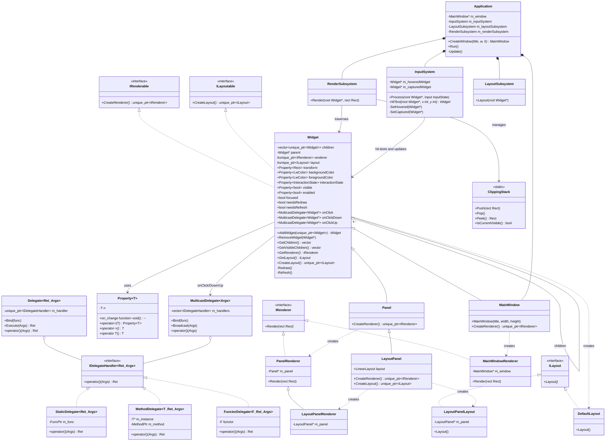

<!-- TOC -->
* [Widget Architecture — UML Class Diagram](#widget-architecture--uml-class-diagram)
<!-- TOC -->

# Widget Architecture — UML Class Diagram

```mermaid
classDiagram
    %% ── Interfaces ──────────────────────────────────────────────
    class IRenderer {
        <<interface>>
        +Render(rect Rect)*
    }

    class IRenderable {
        <<interface>>
        +CreateRenderer() unique_ptr~IRenderer~*
    }

    class ILayout {
        <<interface>>
        +Layout()*
    }

    class ILayoutable {
        <<interface>>
        +CreateLayout() unique_ptr~ILayout~*
    }

    %% ── Property ────────────────────────────────────────────────
    class Property~T~ {
        -T n
        +on_change function~void()~
        +operator=(T) Property~T~
        +operator->() T*
        +operator T() T
    }

    %% ── Delegate system ─────────────────────────────────────────
    class IDelegateHandler~Ret_Args~ {
        <<interface>>
        +operator()(Args) Ret*
    }

    class StaticDelegate~Ret_Args~ {
        -FuncPtr m_func
        +operator()(Args) Ret
    }

    class MethodDelegate~T_Ret_Args~ {
        -T* m_instance
        -MethodPtr m_method
        +operator()(Args) Ret
    }

    class FunctorDelegate~F_Ret_Args~ {
        -F functor
        +operator()(Args) Ret
    }

    class Delegate~Ret_Args~ {
        -unique_ptr~IDelegateHandler~ m_handler
        +Bind(func)
        +Execute(Args) Ret
        +operator()(Args) Ret
    }

    class MulticastDelegate~Args~ {
        -vector~IDelegateHandler~ m_handlers
        +Bind(func)
        +Broadcast(Args)
        +operator()(Args)
    }

    IDelegateHandler <|.. StaticDelegate
    IDelegateHandler <|.. MethodDelegate
    IDelegateHandler <|.. FunctorDelegate
    Delegate o-- IDelegateHandler
    MulticastDelegate o-- IDelegateHandler

    %% ── Widget ──────────────────────────────────────────────────
    class Widget {
        -vector~unique_ptr~Widget~~ children
        -Widget* parent
        #unique_ptr~IRenderer~ renderer
        #unique_ptr~ILayout~ layout
        +Property~Rect~ transform
        +Property~LwColor~ backgroundColor
        +Property~LwColor~ foregroundColor
        +Property~InteractionState~ interactionState
        +Property~bool~ visible
        +Property~bool~ enabled
        +bool focused
        +bool needsRedraw
        +bool needsRefresh
        +MulticastDelegate~Widget*~ onClick
        +MulticastDelegate~Widget*~ onClickDown
        +MulticastDelegate~Widget*~ onClickUp
        +AddWidget(unique_ptr~Widget~) Widget*
        +RemoveWidget(Widget*)
        +GetChildren() vector
        +GetVisibleChildren() vector
        +GetRenderer() IRenderer*
        +GetLayout() ILayout*
        +CreateLayout() unique_ptr~ILayout~
        -Redraw()
        -Refresh()
    }

    IRenderable <|.. Widget
    ILayoutable <|.. Widget
    Widget "1" o-- "0..*" Widget : children
    Widget --> Property : uses
    Widget --> MulticastDelegate : onClick/Down/Up

    %% ── Concrete Widgets ────────────────────────────────────────
    class MainWindow {
        +MainWindow(title, width, height)
        +CreateRenderer() unique_ptr~IRenderer~
    }

    class Panel {
        +CreateRenderer() unique_ptr~IRenderer~
    }

    class LayoutPanel {
        +LinearLayout layout
        +CreateRenderer() unique_ptr~IRenderer~
        +CreateLayout() unique_ptr~ILayout~
    }

    Widget <|-- MainWindow
    Widget <|-- Panel
    Panel <|-- LayoutPanel

    %% ── Renderers ───────────────────────────────────────────────
    class MainWindowRenderer {
        -MainWindow* m_window
        +Render(rect Rect)
    }

    class PanelRenderer {
        -Panel* m_panel
        +Render(rect Rect)
    }

    class LayoutPanelRenderer {
        -LayoutPanel* m_panel
    }

    IRenderer <|.. MainWindowRenderer
    IRenderer <|.. PanelRenderer
    PanelRenderer <|-- LayoutPanelRenderer

    MainWindow ..> MainWindowRenderer : creates
    Panel ..> PanelRenderer : creates
    LayoutPanel ..> LayoutPanelRenderer : creates

    %% ── Layouts ─────────────────────────────────────────────────
    class DefaultLayout {
        +Layout()
    }

    class LayoutPanelLayout {
        -LayoutPanel* m_panel
        +Layout()
    }

    ILayout <|.. DefaultLayout
    ILayout <|.. LayoutPanelLayout

    Widget ..> DefaultLayout : creates
    LayoutPanel ..> LayoutPanelLayout : creates

    %% ── Subsystems ──────────────────────────────────────────────
    class RenderSubsystem {
        +Render(root Widget*, rect Rect)
    }

    class InputSystem {
        -Widget* m_hoveredWidget
        -Widget* m_capturedWidget
        +Process(root Widget*, input InputState)
        -HitTest(root Widget*, x int, y int) Widget*
        -SetHovered(Widget*)
        -SetCaptured(Widget*)
    }

    class LayoutSubsystem {
        +Layout(root Widget*)
    }

    class ClippingStack {
        <<static>>
        +Push(rect Rect)
        +Pop()
        +Peek() Rect
        +IsCurrentVisible() bool
    }

    RenderSubsystem --> Widget : traverses
    RenderSubsystem --> ClippingStack : manages
    InputSystem --> Widget : hit-tests and updates

    %% ── Application ─────────────────────────────────────────────
    class Application {
        -MainWindow* m_window
        -InputSystem m_inputSystem
        -LayoutSubsystem m_layoutSubsystem
        -RenderSubsystem m_renderSubsystem
        +CreateWindow(title, w, h) MainWindow*
        +Run()
        -Update()
    }

    Application *-- MainWindow
    Application *-- InputSystem
    Application *-- LayoutSubsystem
    Application *-- RenderSubsystem
```
